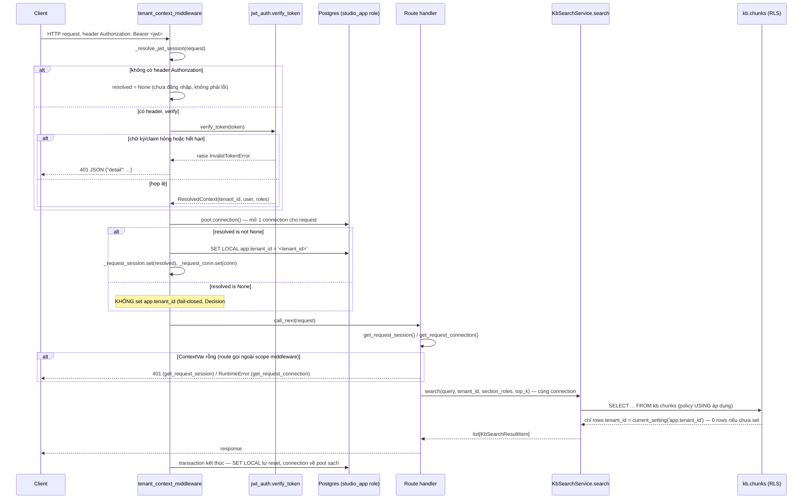

# Flow 1 — Auth → tenant resolve → RLS-fenced request

> Phạm vi: từ HTTP request có `Authorization: Bearer <jwt>` đến khi một query chạm `kb.chunks` dưới
> RLS. Không phải luồng interpreter tự tiêm tenant vào node params khi chạy DAG — đó là
> [Flow 3](03-interpreter-dag.md#5-sessioncontext--vì-sao-không-nằm-trong-contracts) (INV-1 ở tầng
> engine). Đây là 2 cơ chế riêng, cùng đích: dữ liệu tenant không bao giờ đến từ client.
> Claim đối chiếu code thật tại HEAD hiện tại — xem [system-architecture.md](../system-architecture.md).

## 1. Actor & component

| Actor/component | File | Vai trò |
|---|---|---|
| `tenant_context_middleware` | `apps/studio/src/studio_app/middleware.py:112` | 1 connection + 1 transaction/request, `SET LOCAL app.tenant_id` |
| `_resolve_jwt_session` | `middleware.py:87` | đọc header `Authorization`, gọi `jwt_auth.verify_token` |
| `jwt_auth.verify_token` | `apps/studio/src/studio_app/jwt_auth.py:126` | verify chữ ký HS256 + decode claims → `ResolvedContext` trực tiếp |
| `ResolvedContext` | `packages/workbench/src/studio_workbench/tenant_wall.py:44` | dataclass frozen `{tenant_id, user, roles}` |
| `get_request_session`/`get_request_connection` | `middleware.py:47`/`:37` | đọc lại session/connection trong route, fail-closed |
| 2 role Postgres | `docker/postgres-init/00-roles.sql` | `studio_owner` (DDL, bypass RLS trừ khi FORCE) / `studio_app` (DML qua GRANT, RLS luôn áp) |
| RLS policy `kb.chunks` | `packages/kb/src/studio_kb/schema.py` | `USING`/`WITH CHECK` khoá theo `current_setting('app.tenant_id')` |

**Lưu ý quan trọng — 2 seam khác nhau cùng tên hình dạng:** `studio_workbench.tenant_wall.resolve_session`/`resolve_tenant_id`
(`tenant_wall.py:72,140`) **không nằm trong chain HTTP middleware này**. Middleware chỉ gọi thẳng
`jwt_auth.verify_token`, hàm này tự decode claims và build `ResolvedContext` trực tiếp — **không** đi
qua `tenant_wall.resolve_session`. `tenant_wall` là seam Tenant-Wall riêng ở biên API workbench (đọc
từ 1 session mapping tổng quát hơn, dùng ở nơi khác cần resolve session mà không có JWT object sẵn
trong tay) — hai đường cùng tạo ra `ResolvedContext`, nhưng là 2 call site độc lập, không đường nào
gọi đường kia.

## 2. Sequence diagram



## 3. Cơ chế RLS (chi tiết)

### 3.1. Hai role Postgres (`docker/postgres-init/00-roles.sql`)

- `studio_owner` — `NOSUPERUSER NOCREATEDB NOCREATEROLE`, owner của mọi schema/table
  (`ensure_all_schemas()` chạy bằng role này). Vì là owner, `FORCE ROW LEVEL SECURITY` mới "cắn"
  được chính nó — mặc định Postgres cho owner bypass RLS trừ khi bảng đó `FORCE`.
- `studio_app` — `NOSUPERUSER NOCREATEDB NOCREATEROLE`, non-owner, chỉ có DML qua GRANT tập trung
  (`grant_app_privileges()`), không có `CREATE ON DATABASE`.
- Cả hai `NOSUPERUSER` — không role nào bypass RLS qua đặc quyền superuser.

### 3.2. Pool split (`apps/studio/src/studio_app/core/_db.py`)

| Pool | Role | Dùng cho | RLS áp dụng? |
|---|---|---|---|
| `get_admin_pool()` | `studio_owner` | DDL bootstrap (`ensure_all_schemas`/`grant_app_privileges`) lúc boot | Không (owner bypass) |
| `get_pool()` | `studio_app` | Toàn bộ request path — pool duy nhất middleware dùng | **Có** — đây là pool RLS thật sự áp |

Bất biến: không bao giờ chạy DDL qua `get_pool()`, không bao giờ chạy query request-path qua
`get_admin_pool()` (docstring module ghi rõ).

### 3.3. Policy trên `kb.chunks` (`packages/kb/src/studio_kb/schema.py`)

```sql
ALTER TABLE kb.chunks ENABLE ROW LEVEL SECURITY;
ALTER TABLE kb.chunks FORCE ROW LEVEL SECURITY;

CREATE POLICY kb_chunks_tenant_isolation ON kb.chunks
    USING (tenant_id = NULLIF(current_setting('app.tenant_id', true), '')::uuid)
    WITH CHECK (tenant_id = NULLIF(current_setting('app.tenant_id', true), '')::uuid);
```

- `USING` chặn đọc cross-tenant; `WITH CHECK` chặn ghi cross-tenant — 2 vế độc lập.
- `current_setting(..., true)` → chưa set trả `NULL` thay vì raise; `NULLIF(..., '')` xử lý chuỗi
  rỗng cùng cách; `tenant_id = NULL` không bao giờ đúng (SQL 3-valued logic) → **0 rows**, không
  phải "trả hết" — fail-closed đúng nghĩa.
- `FORCE ROW LEVEL SECURITY` áp policy cả lên `studio_owner` — đóng lỗ hổng "owner bypass" dù đây
  không phải đường vận hành bình thường.

### 3.4. GRANT tập trung (`core/schema.py::grant_app_privileges`)

Một hàm, gọi ngay sau `ensure_all_schemas()`: `GRANT USAGE` + `GRANT SELECT, INSERT, UPDATE, DELETE`
+ `ALTER DEFAULT PRIVILEGES FOR ROLE studio_owner` trên cả 5 schema (`kb, wb, obs, eval, core`) cho
`studio_app` — tránh rải GRANT theo từng owner riêng lẻ.

### 3.5. Middleware — 1 conn/txn per request qua ContextVar

`apps/studio/src/studio_app/middleware.py:112` (`tenant_context_middleware`):
- Mở **1 connection từ `get_pool()`** mỗi request, giữ qua `ContextVar _request_conn` suốt vòng đời.
- Resolve tenant server-side qua JWT (§4 dưới); không resolve được → **không set `app.tenant_id`**
  (mặc định fail-closed, Decision #3).
- Resolve được → `SET LOCAL app.tenant_id = <literal>` dùng `sql.Literal` (không phải bind param —
  `SET LOCAL` là utility statement, không nhận bind qua wire protocol). `SET LOCAL` chỉ hiệu lực
  trong transaction hiện tại — tự reset khi transaction kết thúc, connection trả về pool không mang
  theo tenant setting cũ (chống leak qua pool reuse).

## 4. JWT — nguồn tenant duy nhất (đã sửa khỏi header-stub)

**Đường cũ đã bị xoá hẳn, không phải deprioritize:** trước bản vá `kit#129` §3.2 (VinSOC
AV-203064/AV-203754, High cả 2 lượt quét), middleware từng tin thẳng header `x-tenant-id` client tự
khai — dev-time stub, không verify. Đường đó đã **xoá hoàn toàn** khỏi `middleware.py`, không còn
nhánh fallback nào đọc header đó. Từ nay `Authorization: Bearer <jwt>` là **nguồn duy nhất** xác định
tenant của một request:

- `jwt_auth.verify_token(token)` (`jwt_auth.py:126`) verify chữ ký HS256 bằng `settings.jwt_secret`,
  decode `tenant_id`/`user`/`roles` từ claims, raise `InvalidTokenError` cho **mọi** lỗi (chữ ký sai,
  hết hạn, thiếu claim, `tenant_id` không parse được thành UUID) — không có nhánh "đoán giá trị mặc
  định".
- Không có header `Authorization` → `_resolve_jwt_session` trả `None` (chưa đăng nhập, khác "có
  token nhưng sai") → middleware không set `app.tenant_id`, route nào cần định danh tự gọi
  `get_request_session()` và nhận 401.
- Có header nhưng verify fail → `InvalidTokenError` → middleware trả thẳng 401 JSON, không rơi vào
  nhánh nào khác.
- `issue_token()` (cấp JWT) giờ chỉ gọi được từ `routes/auth.py::login` **sau khi** verify mật khẩu
  thật khớp `core.users.password_hash` — route `demo_login` (ký token cho bất kỳ tenant nào không
  cần mật khẩu) đã bị xoá.

## 5. Bất biến fail-closed

| Bất biến | Cơ chế |
|---|---|
| Session chưa resolve → không có identity nào rò ra | `get_request_session()` raise `HTTPException(401)` nếu `ContextVar` rỗng |
| Connection chưa bind tenant → không query nào chạy ngoài scope | `get_request_connection()` raise `RuntimeError` nếu `ContextVar` rỗng |
| `app.tenant_id` chưa set → 0 rows, không phải "trả hết" | `NULLIF(current_setting(..., true), '')::uuid` → `NULL` → không match bất kỳ `tenant_id` nào |
| JWT hết hạn theo đổi mật khẩu | `password_changed_at` (`core.users`) so với `iat` của token (`get_request_token_issued_at`), route `authz.fetch_fresh_identity` |
| Pool reuse không rò tenant cũ | `SET LOCAL` tự reset theo transaction, không phải theo connection |

## 6. Test evidence

`packages/kb/tests/test_rls_framework.py` (xanh, không red-by-design): `test_no_tenant_zero_rows`,
`test_tenant_scoped_visibility`, `test_force_rls_and_with_check`. Xem thêm
[`docs/test-design/GUIDE-A-isolation.md`](../test-design/GUIDE-A-isolation.md) cho ma trận test đầy
đủ (bao gồm `test_leak.py` — leak-test T1 IDOR, đã un-ratchet khỏi `xfail`, hiện là hard gate).

## 7. Liên hệ chéo luồng

Flow 3 (interpreter) có cơ chế tenant-fence **riêng**, ở tầng khác: `interpreter.run()` nhận
`session_context: SessionContext` (Protocol, không phải `ResolvedContext` trực tiếp — cùng shape,
khác identity) và tự tiêm `session_context.tenant_id` vào `node.params` của node `kb-retrieve`,
ghi đè bất kỳ giá trị client khai nào trong node params. Đây không phải lặp lại RLS — là lớp fence
thứ 2, ở tầng dispatch node, độc lập với transaction Postgres của flow này. Xem
[Flow 3 §4](03-interpreter-dag.md#4-inv-1--bất-biến-tiêm-tenant).
