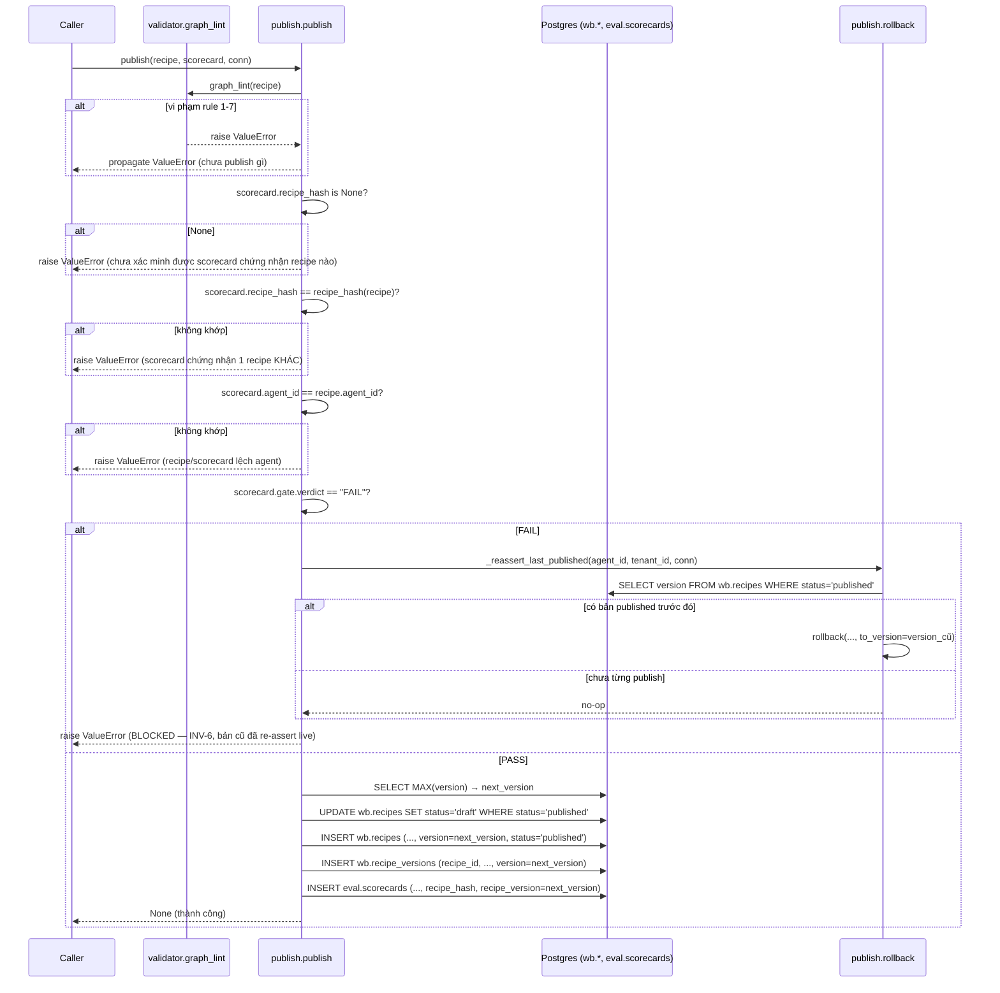

# Flow 2 — Recipe lifecycle: create → graph_lint → publish/rollback

> Phạm vi: từ một `Recipe` (đã dựng qua form/canvas) đến khi nó trở thành phiên bản "published" của
> `(agent_id, tenant_id)`, hoặc bị chặn + rollback về bản trước. Không phải luồng interpreter chạy
> recipe đã publish — đó là [Flow 3](03-interpreter-dag.md). Verdict `PASS`/`FAIL` mà `publish()` đọc
> đến từ [Flow 4](04-eval-gate.md), không tính lại ở đây.

## 1. `graph_lint` — 7 rule (`packages/workbench/src/studio_workbench/validator.py:49`)

| # | Rule | Kiểm tra | Vi phạm → |
|---|---|---|---|
| 1 | node ∈ 6 `NodeType` đóng | mỗi `Node.type` phải thuộc 6 giá trị `NodeType` | `ValueError` (defense-in-depth — pydantic đã chặn ở construction bình thường) |
| 2 | edge có đích thật | `edge.from_`/`edge.to` phải trỏ tới node id có thật | `ValueError`, không âm thầm bỏ qua |
| 3 | đúng 1 start node | đúng 1 node id không có incoming edge | `ValueError` nếu 0 hoặc >1 |
| 4 | mỗi node ≤1 outgoing edge | **TẠM THỜI** — xem cảnh báo dưới | `ValueError` |
| 5 | không có chu trình cấm | 3-color DFS (WHITE/GRAY/BLACK), duyệt theo `dag.nodes` (list order, không phải set — tránh phi-determinism từ `PYTHONHASHSEED`) | `ValueError` khi chạm lại node GRAY |
| 6 | walk kết thúc TẠI node `end` | từ start node, đi theo outgoing edge đến khi gặp `NodeType.END` | `ValueError` nếu hết cạnh trước khi tới `end` |
| 7 | tool ∈ whitelist | mọi node `tool-call` có `params["tool"]` ∈ `agent_config.tool_whitelist` | `ValueError` |

Raise `ValueError` ở vi phạm ĐẦU TIÊN tìm thấy (không trả boolean/error-list) — recipe hoặc pass sạch,
hoặc không đến được interpreter. Rule 6 dựa vào rule 3+4+5 đã đảm bảo đúng 1 đường đi xác định trước
khi walk.

**Cảnh báo — rule 4 hiện đang lệch với engine:** docstring `validator.py` tự ghi rule 4 là "TẠM THỜI,
gắn với tiến độ `ConditionExecutor`" và sẽ nới khi executor đó implement xong để cho phép `condition`
node phân nhánh (>1 outgoing edge). [Flow 3](03-interpreter-dag.md) xác nhận `ConditionExecutor` **đã**
implement thật (D14) — nhưng `graph_lint` rule 4 **chưa được nới**, vẫn chặn mọi recipe có node
>1 outgoing edge, kể cả `condition` hợp lệ. Đây là khoảng lệch thật giữa 2 quadrant tại thời điểm viết
tài liệu này, không phải suy diễn — bằng chứng: `interpreter.py` có nhánh tiêm `state`/`when` đầy đủ
cho `condition` (walk vẫn single-successor, DEC-A), trong khi `validator.py:98-107` vẫn raise nếu thấy
>1 outgoing edge trên bất kỳ node nào.

## 2. `recipe_hash` — hash canonical (`publish.py:145`)

```python
canonical = json.dumps(
    recipe.model_dump(mode="json", by_alias=True),
    sort_keys=True, separators=(",", ":"), ensure_ascii=False,
)
sha256(canonical.encode("utf-8")).hexdigest()
```

- `by_alias=True` **bắt buộc** — `Edge.from_` mang `Field(alias="from")`; dump không alias và có
  alias cho 2 chuỗi byte khác nhau cho CÙNG một recipe.
- `sort_keys=True` **bắt buộc** — `Node.params: dict[str, object]` là dict tự do, giữ insertion order
  khi serialize; 2 recipe cùng nội dung nhưng `params` dựng theo thứ tự khác nhau sẽ hash khác nhau
  nếu không sort.
- Đây là producer cho `Scorecard.recipe_hash` (`DEC-03`) — sống ở `studio_workbench`, không phải
  `studio_evalhub`, vì (a) evalhub bị AST-guard cấm tự dẫn xuất hash (`test_src_khong_tu_dan_xuat_recipe_hash`),
  (b) `Recipe`'s canonical byte-form vốn là câu hỏi của package sở hữu `Recipe`.

## 3. Sequence diagram — `publish()`/`rollback()`



`rollback(agent_id, tenant_id, *, to_version, conn)` đọc `wb.recipe_versions` theo nội dung
(`ORDER BY created_at DESC LIMIT 1` — bảng này KHÔNG có `UNIQUE(agent_id, tenant_id, version)` như
`wb.recipes`, nên có thể có nhiều dòng cùng version). Nếu `wb.recipes` row của `to_version` không còn
tồn tại VÀ `history_recipe_hash is None` (bản publish trước `DEC-03`, không hash được) → raise, từ
chối tái tạo 1 dòng `'published'` không xác minh được.

## 4. Bất biến quan trọng

- **`publish()` không tin `scorecard.recipe_hash` mù quáng** — luôn tính lại `recipe_hash(recipe)` từ
  chính `Recipe` đang publish và đòi khớp tuyệt đối. Chặn ca caller (vô tình hoặc cố ý) đưa `publish()`
  một recipe khác với recipe đã được chấm.
- **`gate.verdict == "FAIL"` là hard gate (INV-6)** — không advisory. `publish.py` chỉ ĐỌC field này,
  không tự tính lại verdict (đó là việc `compute_scorecard`, [Flow 4](04-eval-gate.md)).
- **Nhánh FAIL re-assert bản cũ TRƯỚC KHI raise** — không phải raise suông rồi để endpoint treo ở
  trạng thái không xác định.
- **RLS trên `wb.*` là fence duy nhất cho `conn` sai tenant** — một `conn` chưa bind đúng tenant thấy/ghi
  0 rows thay vì raise; các câu `WHERE tenant_id = %s` trong `publish.py`/`rollback()` KHÔNG phải fence
  chính, chỉ là defense-in-depth song song với RLS.

## 5. Liên hệ chéo luồng

`scorecard.gate.verdict` (đọc ở §3 trên) được sản xuất hoàn toàn bởi
[Flow 4](04-eval-gate.md#3-compute_scorecard--rule) — `publish.py` không bao giờ tính lại
`success_rate`/`citation_accuracy`, chỉ đọc `gate.verdict` đã chốt.

## 6. Test evidence

[`docs/test-design/GUIDE-B-recipe.md`](../test-design/GUIDE-B-recipe.md) — ma trận `recipe_validity` ×
`publish_state`, sở hữu SWE.
