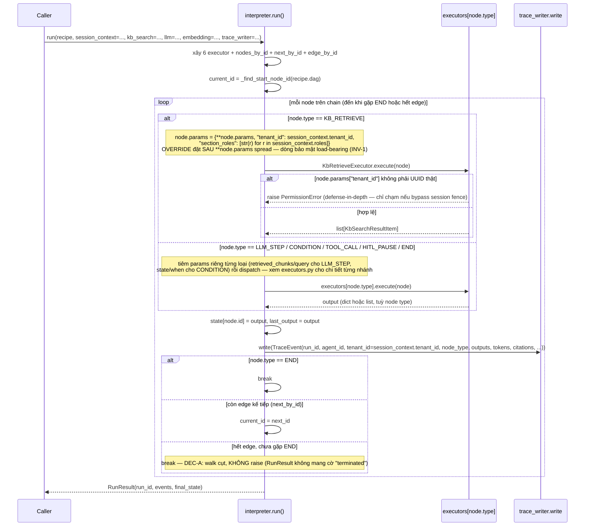

# Flow 3 — Interpreter: DAG walk qua 6 node executor

> Phạm vi: `interpreter.run()` nhận 1 `Recipe` đã qua `graph_lint` ([Flow 2](02-recipe-lifecycle.md))
> + 1 `session_context`, walk DAG, dispatch từng node tới executor tương ứng, ghi `TraceEvent`. Không
> tự validate lại cấu trúc DAG (Day 12, DEC-A) — trust `graph_lint` đã chạy trước.

## 1. Registry & dispatch (`registry.py`, `interpreter.py:237`)

```
REGISTRY: dict[NodeType, type[NodeExecutor]] = {tất cả 6 NodeType → class tương ứng}
```

`interpreter.run()` xây **6 instance executor cụ thể** mỗi lần gọi (constructor-DI, không factory
chung): `KbRetrieveExecutor(kb_search)`, `LlmStepExecutor(llm, embedding)`,
`ToolCallExecutor(WhitelistToolDispatch(recipe.agent_config.tool_whitelist))`, `ConditionExecutor()`,
`HitlPauseExecutor()`, `EndExecutor()`. Walk bắt đầu từ `_find_start_node_id(recipe.dag)` — node duy
nhất không có edge nào trỏ tới; **không** re-validate cấu trúc (đã tin `graph_lint`, Day 12 DEC-A).

## 2. Sequence diagram



6 node type dispatch qua CÙNG 1 điểm gọi `await executors[node_type].execute(node)`
(`interpreter.py:375`) — không có nhánh `try/except` bao quanh, nên mọi executor phải tự fail-closed
nội bộ (không raise ngoài ý muốn) trừ `KbRetrieveExecutor` (raise `PermissionError` có chủ đích) và
`ToolCallExecutor` khi `dispatcher=None` (raise `NotImplementedError` có chủ đích, xem §3).

## 3. Trạng thái 6 executor

Đã verify trực tiếp code thật tại HEAD — không phải bản cũ mô tả "ĐỂ TRỐNG".

| Executor | Trạng thái | Ghi chú |
|---|---|---|
| `KbRetrieveExecutor` | **Implement thật** | Fail-closed `PermissionError` nếu `tenant_id` post-override không phải UUID (`executors.py:174`) |
| `LlmStepExecutor` | **Implement thật** | Trích citation bằng regex `[chunk_id]`, chỉ giữ citation vừa được cite VÀ có trong `retrieved_chunks` — không fallback về raw extraction |
| `ConditionExecutor` | **Implement thật** (D14) | Grammar `"<field> <op> <literal>"`, KHÔNG BAO GIỜ raise — mọi lỗi thành `reason` string; `result` là `bool` ⟺ `reason == "ok"` |
| `ToolCallExecutor` | **1 nhánh còn seam thật** | `dispatcher=None` (default) → raise `NotImplementedError` — chỉ đường walk thật (interpreter luôn wire `WhitelistToolDispatch`) mới không chạm nhánh này |
| `HitlPauseExecutor` | **Implement thật, nhưng chưa pause thật** | Trả `{"paused": True, "status": "pending_approval"}` — walk vẫn tiếp tục ngay, KHÔNG dừng/chờ approval thật (wiring pause/resume còn ngoài scope hiện tại) |
| `EndExecutor` | **Implement thật** | `{"terminated": True}` — tín hiệu duy nhất khiến walk `break` |

## 4. INV-1 — bất biến tiêm tenant

- `session_context.tenant_id`/`session_context.roles` luôn ghi đè bất kỳ giá trị `tenant_id`/
  `section_roles` nào node đã khai trong `params` — override đặt **sau** `**node.params` spread
  (`interpreter.py:320-328`, đúng dòng `"tenant_id": session_context.tenant_id,` ở `:324`).
- Mọi `TraceEvent.tenant_id` cũng lấy từ `session_context.tenant_id` (`interpreter.py:431`), không
  bao giờ từ `recipe.tenant_id` (client khai).
- Lệch tenant (recipe khai một đằng, session resolve nẻo khác) **không phải lỗi** — run vẫn chạy,
  chỉ bị thu hẹp về tenant của session.
- `KbRetrieveExecutor` fail-closed bằng `raise PermissionError`, không phải sentinel — bản trước dùng
  `UUID(int=0)`, fail-closed *do may* (tình cờ khớp 0 dòng) chứ không do hợp đồng.
- `section_roles` không có nhánh raise tương đương (`roles=[]` đã là deny-all tại tầng retrieval:
  `allowed = set(section_roles)`, tập rỗng không khớp gì).

## 5. `SessionContext` — vì sao không nằm trong `contracts`

`session.py::SessionContext` (`packages/engine/src/studio_engine/session.py:55`) khai trong
`studio_engine`, **không phải** `studio_contracts`, và **không tái dùng**
`studio_workbench.tenant_wall.ResolvedContext` ([Flow 1](01-auth-tenant-rls.md#1-actor--component)) dù 2
class có shape giống hệt nhau. Lý do: `.importlinter` xếp `studio_engine` và `studio_workbench` là
2 quadrant **sibling** dưới `studio_app`, cấm import lẫn nhau. Structural typing gỡ nút này —
`ResolvedContext` thoả `SessionContext` sẵn mà không cần adapter/cross-import, vì composition root
(`apps/studio`, tầng DUY NHẤT được import cả hai quadrant) truyền thẳng object qua.

3 field khai bằng `@property` read-only (không phải attribute thường) — chủ đích: một
`@dataclass(frozen=True)` (field không gán lại được) mới thoả Protocol dưới `mypy --strict`; Protocol
khai attribute thường sẽ loại frozen dataclass vì variance mismatch.

Tag-vs-isolation: một `tenant_id` field trên request là TAG, không phải fence tự thân — bất cứ gì chỉ
*mang* giá trị (request body, recipe document, header client tự set) là 1 claim, không phải bảo đảm.
Fence thật nằm ở chỗ giá trị chỉ có 1 đường lên wire mà client không ảnh hưởng được: `session_context`
resolve server-side, `interpreter.run()` đọc `.tenant_id` từ đó thay vì `recipe.tenant_id` — chính là
fence, không phải quy ước.

## 6. Test evidence

[`docs/test-design/GUIDE-D-interpreter.md`](../test-design/GUIDE-D-interpreter.md).

## 7. Liên hệ chéo luồng

Fence tầng data-plane (RLS Postgres) là [Flow 1](01-auth-tenant-rls.md) — cơ chế khác, cùng nguyên
tắc "không bao giờ tin client". `KbSearch.search()` mà `KbRetrieveExecutor` gọi là seam
`studio_kb` (DE), impl thật `PgKbSearch` chỉ nối ở composition root (`apps/studio`) — `studio_engine`
không import `studio_kb` trực tiếp (`.importlinter`).
