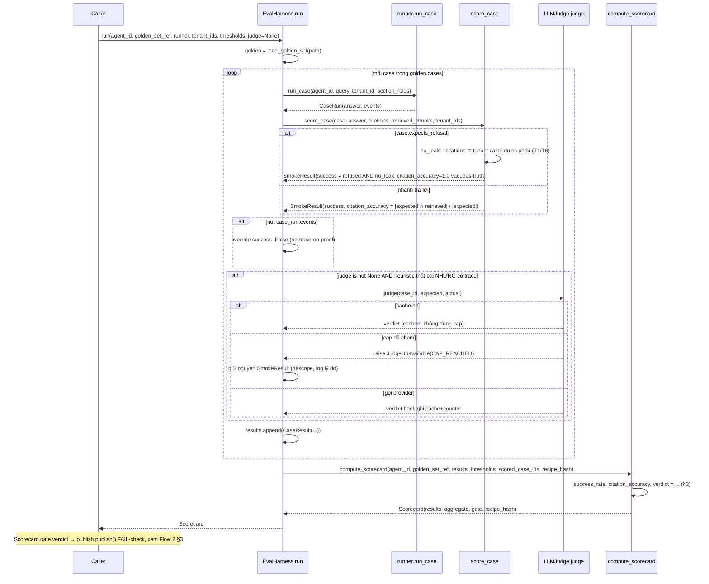

# Flow 4 — Eval: harness → judge → compute_scorecard → gate chặn publish

> Phạm vi: từ 1 golden set + 1 recipe đến `Scorecard.gate.verdict` — verdict này chính là input
> [Flow 2](02-recipe-lifecycle.md#3-sequence-diagram--publishrollback) đọc để quyết publish/rollback.
> Không phải luồng chạy interpreter cho từng case — đó là [Flow 3](03-interpreter-dag.md), gọi lại từ
> `runner.run_case()` trong luồng này.

## 1. Harness — 2 mẫu số khác nhau, đó là toàn bộ nội dung (`DEC-04`)

`EvalHarness.run()` (`harness.py`) loop qua từng case của golden set: gọi
`runner.run_case(agent_id, query, tenant_id, section_roles)` → `CaseRun`, chấm qua `score_case()`
(nhánh trả-lời khác nhánh từ-chối — nhánh từ-chối còn kiểm cross-tenant citation leak, chạm thẳng
[Flow 1](01-auth-tenant-rls.md)'s fence), rồi tuỳ điều kiện hỏi `LLMJudge` (§2).

- **`success_rate`** = `k_success / len(results)` — **mọi** case, kể cả từ-chối (case từ-chối có
  `success` thật: agent từ chối đúng hay không).
- **`citation_accuracy`** = `Σ acc / n_scored`, `n_scored` = **chỉ case nhánh trả-lời**. Case từ-chối
  mang `citation_accuracy = 1.0` như quy ước vacuous-truth, KHÔNG phải phép đo — thả vào mẫu số này
  kéo điểm lên giả.
- Đo được thực tế: bộ 10 case báo `0.90` trong khi số thật `0.833` — `10×1.0 + 20×0.85 = 0.90` đúng
  ngưỡng nhưng lẽ ra phải FAIL.
- `scored_case_ids` do **caller cung cấp**, không phải hàm tự suy — `CaseResult` không mang cờ nhánh,
  và 3 đường suy tự động (từ `citation_accuracy == 1.0`, thêm field mới, chỉ truyền count) đều sai
  hoặc breaking. Caller biết nhánh vì nó cầm `GoldenCase`.

## 2. LLM Judge — cache → cap → provider (thứ tự là hợp đồng)

`LLMJudge.judge(case_id, expected, actual) -> bool` (`judge.py:170`), gọi khi heuristic score thất
bại nhưng trace có tồn tại (`_duoc_hoi_judge`):

1. **Cache trước** (khoá `(case_id, actual)` — lồng 2 tầng, KHÔNG nối chuỗi vì `actual` là text tự
   do). Hit → trả ngay, **không đụng counter**, kể cả khi đã chạm cap.
2. **Cap sau** (`≤100 call/ngày`, bền qua file, khoá theo **ngày UTC** không phải per-process — RAM
   counter sẽ reset mỗi lần restart, làm cap thật thành vô hạn). Chạm trần →
   `raise JudgeUnavailable(CAP_REACHED)`, provider KHÔNG bị chạm.
3. **Gọi provider cuối** — lỗi bất kỳ → `raise JudgeUnavailable(PROVIDER_UNAVAILABLE)`. Counter được
   ghi **ngay khi call trả về, trước khi parse** — quota đã tiêu tại thời điểm gọi, không phải tại
   thời điểm parse thành công (chặn "gọi lại miễn phí" mỗi lần model trả rác).

`_doc_verdict()` (`judge.py:67`) — bất kỳ phản hồi nào không bắt đầu bằng `PASS`/`FAIL` →
`raise JudgeUnavailable(PROVIDER_UNAVAILABLE)`, **không đọc thành `False`**. Đây là chỗ fail-open dễ
lọt nhất: đọc "thứ không phải PASS" thành `False` biến 1 phản hồi rác thành 1 case trượt — sai lớp
với "không chấm được".

`JudgeUnavailable` **không tự fallback** — đó là việc `harness.py` (INV-7 descope-guard): bắt exception,
tụt xuống exact-match, ghi lại lý do tụt.

## 3. `compute_scorecard` — rule

```
success_rate      = count(r.success for r in results) / len(results)                # MỌI case
citation_accuracy = sum(scored.citation_accuracy) / len(scored) if scored else None  # chỉ case trả-lời
verdict = "PASS" iff (success_rate >= threshold_success)
                 AND (citation_accuracy is not None AND citation_accuracy >= threshold_citation_accuracy)
```

**Rule dễ đọc sai nhất:** verdict PASS đòi CẢ 2 threshold đạt **VÀ** `citation_accuracy is not None`.
Một trục chưa đo được (`None`, mẫu số rỗng — mọi case đều từ chối) không tự động PASS chỉ vì
`success_rate` đủ cao — trục chưa đo = FAIL, enforce kép: 1 lần ở logic hàm này, 1 lần ở
`Scorecard._unmeasured_axis_cannot_pass` (§5).

**Fail-closed 2 lớp:** `results` rỗng → `raise` (0 case không chứng minh được gì, không phải
`success_rate = 0.0`); `scored_case_ids` chứa id không có trong `results` → `raise` (bỏ qua im lặng
sẽ làm mẫu số nhỏ hơn ý định mà không ai biết).

**Ghi chú tài liệu nội bộ đang lệch code:** docstring module `compute.py:11` (và tương tự
`harness.py`'s docstring theo báo cáo audit) vẫn ghi *"Body intentionally empty (NotImplementedError)"*
— nhưng thân hàm `compute_scorecard()` bên dưới **đã implement đầy đủ**, không raise gì. Đây là
docstring nội bộ tự mâu thuẫn với code ngay dưới nó, không phải suy diễn từ tài liệu ngoài — worth
biết khi đọc source, không phải một seam thật còn trống.

## 4. Sequence diagram



## 5. Bất biến — `model_validator` enforce thật

`Aggregate._rate_and_denominator_must_agree` (`scorecard.py:114`): `citation_accuracy is None` không
được đi kèm `n_scored_citation > 0` (và ngược lại) — 2 field phải kể cùng 1 câu chuyện.

`Scorecard._unmeasured_axis_cannot_pass` (`scorecard.py:190`): `aggregate.citation_accuracy is None`
+ `gate.verdict == "PASS"` → raise. Sống ở `Scorecard` chứ không `Aggregate` vì bất biến này bắc qua
2 model độc lập (đo ở `aggregate`, quyết ở `gate`) — chỉ `Scorecard` thấy được cả 2. Cố ý MỘT CHIỀU:
`FAIL` với trục đã đo vẫn hợp lệ (fail vì lý do khác); chỉ chặn tổ hợp *chưa đo + PASS*.

## 6. Test evidence

[`docs/test-design/GUIDE-C-eval-gate.md`](../test-design/GUIDE-C-eval-gate.md).

## 7. Liên hệ chéo luồng

`Scorecard.gate.verdict` (§3-5) là input duy nhất [Flow 2](02-recipe-lifecycle.md#3-sequence-diagram--publishrollback)
đọc để quyết publish/block+rollback — `publish.py` không tính lại gì ở đây, chỉ đọc field đã chốt.
