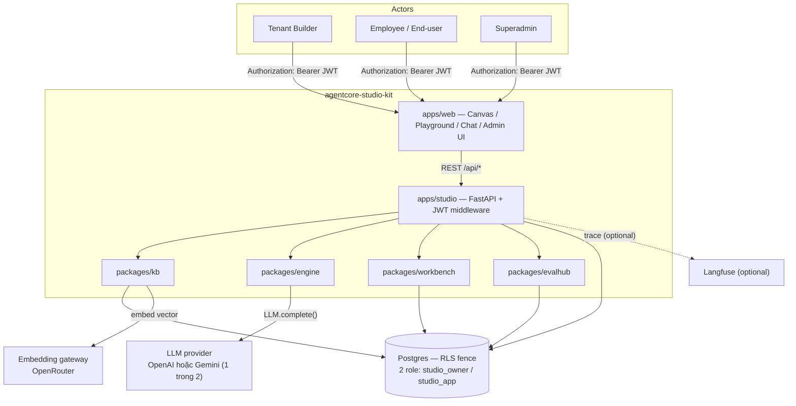
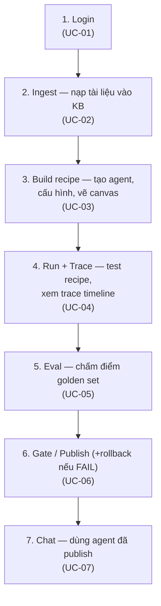

# System Requirement Specification (SRS) — agentcore-studio-kit

> **Ghi chú nguồn:** mọi trạng thái WIRED/PARTIAL/SPEC dưới đây lấy từ đọc trực tiếp code (2026-08-20),
> KHÔNG copy nguyên trạng thái từ `docs/system-architecture.md` — tài liệu đó đã lỗi thời ở nhiều chỗ
> (ví dụ: header `x-tenant-id` dev-stub nó nhắc tới đã bị xoá hẳn; `graph_lint`, `publish/rollback`,
> toàn bộ `evalhub`, `KbSearchService.search` nó ghi "spec" thực ra đã WIRED). SRS này ưu tiên khung
> **8-bước spine** trong `CLAUDE.md` (login → ingest → build recipe → run → trace → eval →
> gate/publish → chat) vì đây là khung hiện hành mentor dùng chấm Day-25, thay vì bảng 8-bước cũ trong
> architecture doc.

## 1. Giới thiệu

**Mục đích:** đặc tả yêu cầu người dùng và chức năng hệ thống của `agentcore-studio-kit`, làm căn cứ
cho build/demo/review giữa AIE-1, AIE-2, DE, SWE và mentor.

**Phạm vi:**
- **In-scope:** toàn bộ vòng đời agent — đăng nhập, nạp tài liệu vào KB, dựng recipe trên canvas, chạy
  thử + xem trace, chấm điểm qua golden set, gate/publish (+ rollback khi FAIL), chat với agent đã
  publish. Gồm cả tenant-fence (RLS + JWT + interpreter) xuyên suốt các bước trên.
- **Out-of-scope:** hạ tầng triển khai production, CI/CD, billing, cost-lineage thật (D19/kit#120,
  chưa làm), HITL-pause thật (P4, chưa làm — xem mục 5.2 và 7.2).

## 2. Context diagram

**Actor:**

| Actor | Vai trò | Kênh |
|---|---|---|
| Tenant Builder | Tạo/cấu hình/vẽ/test/chấm điểm/publish agent | `apps/web` Workbench tab, role builder/admin |
| Employee / End-user | Chat với agent đã publish | `apps/web` Chat tab |
| Superadmin | Quản company/tenant, user, section | `apps/web` Admin/Superadmin console |

**External systems:**

| Hệ thống ngoài | Vai trò | Bắt buộc? |
|---|---|---|
| Postgres | Lưu trữ + RLS fence tenant (2-DSN split: app-pool RLS-scoped / admin-pool DDL-only) | Bắt buộc |
| LLM provider (OpenAI/Gemini) | Sinh câu trả lời — chọn 1 qua `STUDIO_LLM_PROVIDER` | Bắt buộc khi tắt fake (`STUDIO_USE_FAKE_PROVIDERS=false`); mặc định dùng Fake cho dev/CI |
| Embedding gateway (OpenRouter, `google/gemini-embedding-001`) | Nhúng vector cho KB search | Như trên |
| Langfuse | Observability ngoài | Optional |

## 3. Main workflows

| Bước | UC | Trạng thái | Ghi chú |
|---|---|---|---|
| Login | UC-01 | WIRED | JWT HS256, fail-closed |
| Ingest | UC-02 | WIRED (backend) / UI có tên "Placeholder" | route thật, UI cần verify thêm |
| Build recipe | UC-03 | WIRED | `graph_lint` 7 luật, canvas đầy đủ |
| Run + Trace | UC-04 | WIRED (cost chưa đo) | tokens thật, cost luôn "chưa đo" (D19 chưa làm) |
| Eval | UC-05 | WIRED | `EvalHarness`+`LLMJudge`+`compute_scorecard` đủ chuỗi |
| Gate/Publish | UC-06 | WIRED | `publish()` tự rollback khi verdict FAIL |
| Chat | UC-07 | WIRED | route riêng, tách khỏi canvas Test |

**Không nằm trong spine trên nhưng liên quan trực tiếp** (xem 5.2, 7.2): cross-tenant refusal là 1
exception flow của UC-04 (fence proof), không phải bước riêng. HITL-pause KHÔNG phải bước đã hoàn
thành — executor mới có shape, chưa dừng/chờ/resume thật (production-block P4, `CLAUDE.md` mục 6).

## 4. User requirements

| UR | Actor | Yêu cầu | UC | Kỳ vọng phi chức năng |
|---|---|---|---|---|
| UR-01 | Tenant Builder | Tạo agent mới (tên, instructions, model, tool whitelist, KB scope, eval-gate threshold) trong 1 luồng liền mạch | UC-03 | Không mất dữ liệu form khi chuyển giữa modal/canvas |
| UR-02 | Tenant Builder | Vẽ DAG kéo-thả 6 loại node, bị chặn ngay khi vi phạm cấu trúc | UC-03 | Lint tức thời client-side, không cần round-trip server |
| UR-03 | Tenant Builder | Chạy thử agent và xem đúng trace của lần chạy đó, không lẫn tenant/agent khác | UC-04 | Trace phải khớp `run_id`/`agent_id`/`tenant_id` — kiểm bằng GET tách riêng khỏi POST |
| UR-04 | Tenant Builder / Mentor | Agent KHÔNG được trả lời bằng dữ liệu KB của tenant khác | UC-04 | Fail-closed toàn chuỗi (RLS + interpreter override + executor raise), không có đường vòng |
| UR-05 | Tenant Builder | Chấm điểm agent qua golden set trước khi đưa lên live | UC-05 | Publish chỉ sáng khi verdict PASS cho đúng recipe hiện tại (so `recipe_hash`) |
| UR-06 | Tenant Builder | Khi sửa xấu làm gate FAIL, hệ thống tự giữ nguyên bản published cũ | UC-06 | Rollback tự động, ghi audit `wb.recipe_versions` |
| UR-07 | Employee/End-user | Chat với agent đã publish, thấy rõ agent có trích dẫn hay từ chối | UC-07 | Câu trả lời không trích dẫn phải hiện rõ "từ chối", không im lặng bịa |
| UR-08 | Superadmin | Tạo/quản company, user, section; thu hẹp phạm vi xem của user khi cần test | — | Chỉ được THU HẸP, không được MỞ RỘNG vượt section thật (`chat.py::require_admin`) |

## 5. System functionality

### 5.1 Functional requirements theo quadrant

**kb**

| FR | Chức năng | file:line | Trạng thái |
|---|---|---|---|
| FR-KB-01 | `kb.chunks` DDL + RLS (`USING`+`WITH CHECK` theo `tenant_id`) | `kb/schema.py:44-133` | WIRED |
| FR-KB-02 | `KbSearchService.search` — retrieval fence-DATA | `kb/search.py:69-97` | WIRED (D17/#110); embedding fallback bag-of-words nếu không inject thật (PARTIAL semantic) |
| FR-KB-03 | `KbPipeline.chunker/embed_invoke/index` | `kb/pipeline.py:40-89` | WIRED |
| FR-KB-04 | `KbPipeline.consent_purge` / `re_index` | `kb/pipeline.py:91-119` | WIRED (chưa xác nhận có route HTTP riêng) |

**engine**

| FR | Chức năng | file:line | Trạng thái |
|---|---|---|---|
| FR-ENGINE-01 | `registry.py` — 6 NodeType → executor | `engine/registry.py:27-47` | WIRED |
| FR-ENGINE-02 | `KbRetrieveExecutor` — fail-closed `PermissionError` nếu `tenant_id` sai kiểu | `engine/executors.py:87-183` | WIRED |
| FR-ENGINE-03 | `LlmStepExecutor` — citation-gated, `refused = not citations` | `engine/executors.py:222-366` | WIRED |
| FR-ENGINE-04 | `ConditionExecutor` — evaluate `when`, KHÔNG branch walk | `engine/executors.py:429-523` | WIRED-nhưng-partial (interpreter chưa route theo `result`) |
| FR-ENGINE-05 | `ToolCallExecutor` — dispatch tool trong whitelist | `engine/executors.py:538-566` | PARTIAL (raise nếu `dispatcher=None`; walk thật luôn wire dispatcher) |
| FR-ENGINE-06 | `HitlPauseExecutor` — trả shape `{"paused":true}` | `engine/executors.py:569-589` | PARTIAL/SPEC — KHÔNG dừng walk thật, không resume |
| FR-ENGINE-07 | `interpreter.run()` — walk DAG, inject `session_context.tenant_id`+`section_roles` đè `node.params` SAU spread | `engine/interpreter.py:160-460` (đè: 280-328) | WIRED |

**workbench**

| FR | Chức năng | file:line | Trạng thái |
|---|---|---|---|
| FR-WB-01 | `graph_lint(recipe)` — 7 luật DAG | `workbench/validator.py:49-165` | WIRED |
| FR-WB-02 | `recipe_from_canvas` — cổng canvas JSON → `Recipe` đã lint | `workbench/canvas.py:31-50` | WIRED |
| FR-WB-03 | `publish(recipe, scorecard, conn)` — gate 5 điều kiện | `workbench/publish.py:145-258` | WIRED |
| FR-WB-04 | `rollback(agent_id, tenant_id, to_version, conn)` | `workbench/publish.py:261-317` | WIRED |
| FR-WB-05 | `resolve_tenant_id`/`resolve_session` — layer-1 tenant fence | `workbench/tenant_wall.py:72-198` | WIRED |

**evalhub**

| FR | Chức năng | file:line | Trạng thái |
|---|---|---|---|
| FR-EVAL-01 | `eval.golden_sets`+`eval.scorecards` DDL + RLS | `evalhub/schema.py:48-146` | WIRED |
| FR-EVAL-02 | `load_golden_set(path, expect_ref)` | `evalhub/golden_loader.py:45-83` | WIRED |
| FR-EVAL-03 | `EvalHarness.run()` — full golden-set loop | `evalhub/harness.py:492-630` | WIRED (module docstring cũ nói NotImplementedError — comment lỗi thời) |
| FR-EVAL-04 | `LLMJudge.judge` — cache + cap 100 case/ngày + descope | `evalhub/judge.py:141-274` | WIRED |
| FR-EVAL-05 | `compute_scorecard(...)` — gộp `CaseResult[]` → `Scorecard`, quyết `gate.verdict` | `evalhub/compute.py:21-136` | WIRED |

**apps/studio (API surface)**

| Method | Path | file:line | Mục đích |
|---|---|---|---|
| POST | `/api/auth/login` | `auth.py:98` | Đăng nhập, ký JWT |
| PATCH | `/api/auth/password` | `auth.py:207` | Đổi mật khẩu chính mình |
| POST/GET | `/api/admin/companies` | `admin.py:58,272` | Superadmin tạo/liệt kê company |
| POST/GET/PATCH/DELETE | `/api/admin/users[/{id}]` | `admin.py:159,297,336,386,414` | Quản user trong tenant |
| POST/GET/PATCH/DELETE | `/api/admin/sections[/{id}]` | `sections.py:53,88,127,169` | Quản section (role/phòng ban) |
| POST | `/api/admin/documents` | `documents.py:57` | Upload document → KB pipeline (Ingest) |
| GET | `/api/agents` | `agents.py:30` | Liệt kê agent (RLS tự lọc tenant) |
| GET | `/api/agents/{id}/versions`, `/recipe` | `agents.py:57,87` | Version/recipe thật |
| POST | `/api/agents/{id}/rollback` | `agents.py:180` | Rollback |
| POST | `/api/agents/{id}/evaluate`, `/publish` | `publish.py:219,239` | Eval, Publish |
| POST | `/api/agents/{id}/chat` | `chat.py:77` | Chat với agent đã publish |
| POST/GET | `/api/runs[/{id}]` | `runs.py:86,173` | Test recipe / đọc lại trace |

### 5.2 Non-functional requirements

| NFR | Mô tả | Trạng thái | Ghi chú |
|---|---|---|---|
| Tenant isolation | RLS Postgres (`USING`+`WITH CHECK`) + interpreter override + executor fail-closed + JWT-only middleware — 3 lớp phối hợp | WIRED | `x-tenant-id` dev-stub đã bị xoá hẳn (kit#129 §3.2, VinSOC AV-203064/AV-203754) |
| Trace audit | 1 INSERT thuần/node vào `obs.trace_events`, cấm dedup/aggregate | WIRED | RLS **chưa bật** trên bảng này — no-op fence, gap thật (`trace_writer.py:40-43`) |
| Cost tracking | Token đếm thật; `cost` mỗi event luôn `0.0` ("chưa đo", không phải bug) | PARTIAL | Cost-lineage là D19/kit#120, chưa làm |
| Judge quota | `LLMJudge` cap 100 case/ngày, cache theo `(case_id, actual)` | WIRED | Tránh cost bùng nổ khi judge chấm sai |

## 6. Use case specifications

### UC-01 — Login

- **Actor:** bất kỳ user đã có account
- **Precondition:** `core.users` đã tồn tại (tạo bởi Superadmin/Admin)
- **Main flow:**
  1. Nhập email/password ở `Login.tsx`
  2. `POST /api/auth/login` verify bcrypt + rate-limit theo IP
  3. Server ký JWT HS256 (`STUDIO_JWT_EXPIRE_MINUTES` mặc định 480 phút, không có refresh-token)
  4. Client lưu `access_token`+`tenantId`+`tenantName`+`user`+`roles` vào `localStorage`
  5. Mọi request sau đó đính `Authorization: Bearer <token>`
- **Exception flow:** sai mật khẩu hoặc bị rate-limit → 401/429, không lưu session
- **Postcondition:** session hợp lệ; middleware fail-closed resolve đúng tenant cho mọi API call sau đó
- **FR/UR:** FR-STUDIO (auth.py), tiền điều kiện ngầm định cho mọi UC khác

### UC-02 — Ingest (nạp tài liệu vào KB)

- **Actor:** Admin/Superadmin
- **Precondition:** đã login, có quyền admin trên tenant
- **Main flow:**
  1. Upload document qua UI Admin
  2. `POST /api/admin/documents` (multipart)
  3. `KbPipeline.chunker → embed_invoke → index` ghi `kb.chunks` đúng `tenant_id` (RLS `WITH CHECK`)
- **Exception flow:** consent purge — xoá toàn bộ chunk 1 tenant qua `KbPipeline.consent_purge`; chưa
  xác nhận có route HTTP riêng cho thao tác này trong danh sách 23 route đã verify
- **Postcondition:** KB tenant có thêm chunk tìm kiếm được (dùng ở UC-04)
- **FR/UR:** FR-KB-03, FR-KB-04
- **Ghi chú:** tên file UI thực tế là `DocumentsPlaceholderTab.tsx` — chưa verify UI có hoàn chỉnh hay
  còn ở dạng khung, backend route đã wire thật

### UC-03 — Build recipe (tạo + cấu hình + vẽ agent)

- **Actor:** Tenant Builder
- **Precondition:** đã login, role builder/admin
- **Main flow:**
  1. Bấm "Tạo agent" → `window.prompt` tên `agent_id` → tạo khung rỗng trên canvas (`App.tsx:663-700`)
  2. Mở modal "Cấu hình Agent" → điền 8 field (agentId, instructions, model, toolWhitelist, kbId,
     goldenSetRef, successThreshold, citationThreshold)
  3. Kéo-thả node từ Palette (6 loại: kb-retrieve, llm-step, condition, tool-call, hitl-pause, end),
     nối cạnh
  4. `graph_lint()` chạy real-time client-side, đối xứng `validator.py::graph_lint` server-side
- **Exception flow:** vi phạm 1 trong 7 luật (node-type sai, edge không resolve, >1 start-node, >1
  outgoing-edge/node, có cycle, walk không kết thúc ở `end`, tool ngoài whitelist) → banner đỏ, khoá
  nút Test/Publish, không có đường vòng lấy được JSON khi đang đỏ
- **Postcondition:** có 1 `WireRecipe` hợp lệ, sẵn sàng cho UC-04
- **FR/UR:** FR-WB-01, FR-WB-02, UR-01, UR-02

### UC-04 — Run + Trace

- **Actor:** Tenant Builder
- **Precondition:** recipe hiện tại pass `graph_lint` (từ UC-03)
- **Main flow:**
  1. Bấm "Test" → `POST /api/runs` → `interpreter.run()` walk DAG, dispatch qua registry, ghi 1
     `TraceEvent`/node
  2. Interpreter inject `session_context.tenant_id`+`section_roles` đè `node.params` SAU spread — mọi
     `kb-retrieve` chỉ thấy đúng KB tenant/section của session
  3. Client GET riêng `/api/runs/{run_id}` (`fetchTrace`) để xác nhận wiring — không tin thẳng response POST
  4. `TraceViewer` hiện từng event (node_type, tokens, cost, citations), banner
     `agentIdsMatch`+`wiringOk`+`monotonic`, và `render_timeline()` text thật từ `studio_kb.trace_reader`
- **Exception flow (fence proof — cross-tenant refusal):** câu hỏi chỉ trả lời được bằng KB tenant khác
  → `KbRetrieveExecutor` trả 0 chunk (RLS + `session_context` chặn) → `LlmStepExecutor` không trích
  được citation → `refused=true`; event vẫn ghi đủ vào trace làm audit
- **Postcondition:** có `RunResult`/trace đầy đủ; `cost` mỗi event luôn "chưa đo" (hằng số viết chết
  `_NO_COST=0.0`, D19/kit#120 chưa làm — không phải bug UI)
- **FR/UR:** FR-ENGINE-01..07, UR-03, UR-04

### UC-05 — Eval (chấm điểm golden set)

- **Actor:** Tenant Builder
- **Precondition:** recipe pass `graph_lint`, có `golden_set_ref` trỏ tới 1 YAML golden set hợp lệ
- **Main flow:**
  1. Bấm "Chấm điểm" → `POST /api/agents/{id}/evaluate`
  2. `load_golden_set()` nạp YAML, assert `golden_set_ref` khớp
  3. `EvalHarness.run()` — loop từng case, `_score_case_run` (exact-match trên citation từ trace),
     fallback `LLMJudge.judge` nếu exact-match không bắt được
  4. `compute_scorecard()` gộp thành `Scorecard{aggregate.success_rate, aggregate.citation_accuracy,
     gate.verdict}`
- **Exception flow:** `LLMJudge` quá cap/lỗi → `JudgeUnavailable` → case đó descope khỏi tính verdict
  (không giả định pass hay fail)
- **Postcondition:** `Scorecard` hiện trên UI; Publish chỉ sáng nếu verdict=PASS VÀ đúng recipe hiện
  tại (so `recipe_hash`)
- **FR/UR:** FR-EVAL-01..05, UR-05

### UC-06 — Gate / Publish (+ Rollback)

- **Actor:** Tenant Builder
- **Precondition:** đã Chấm điểm verdict=PASS cho đúng recipe hiện tại, HOẶC đang publish lại nguyên
  bản đã publish trước (không sửa gì)
- **Main flow:**
  1. Bấm "Publish" → `POST /api/agents/{id}/publish`
  2. `publish()` kiểm 5 điều kiện: `graph_lint` pass, `scorecard.recipe_hash` khớp `recipe_hash(recipe)`,
     `scorecard.agent_id` khớp, verdict≠FAIL
  3. Ghi 3 bảng cùng transaction: `wb.recipes` (bump version), `wb.recipe_versions` (append-only),
     `eval.scorecards` (audit)
- **Exception flow (gate chặn + rollback):** verdict=FAIL hoặc hash không khớp → 409,
  `_reassert_last_published()` tự rollback về bản published gần nhất — hệ thống không treo ở trạng
  thái lỗi. Rollback thủ công: `POST /api/agents/{id}/rollback` đọc `wb.recipe_versions` theo
  `to_version`
- **Postcondition:** agent có version mới live, hoặc giữ nguyên version cũ nếu bị chặn
- **FR/UR:** FR-WB-03..05, UR-06

### UC-07 — Chat (dùng agent đã publish)

- **Actor:** Employee/End-user (+ Admin ở chế độ test-role)
- **Precondition:** agent có ≥1 version published cho tenant
- **Main flow:**
  1. Vào tab Chat, chọn agent qua dropdown (`GET /api/agents`)
  2. Gõ câu hỏi → `POST /api/agents/{id}/chat`
  3. Server chạy interpreter tương tự UC-04 qua route chat riêng, trả `{answer, citations, refused,
     version, run_id}`
  4. Client GET `/api/runs/{run_id}` riêng để hiện trace (tách khỏi response POST, cùng nguyên tắc UC-04)
  5. (Admin) panel "Thử vai trò" — checkbox section, gửi `as_roles` để xem agent trả lời với role hẹp
     hơn; server chỉ cho THU HẸP, không mở rộng (`chat.py::require_admin`)
- **Exception flow:** agent refused (không trích được citation) → hiện rõ "Từ chối trả lời — không có
  tài liệu phù hợp", không im lặng đưa câu trả lời không căn cứ
- **Postcondition:** lịch sử chat hiện trong session hiện tại (state client — chưa xác nhận có persist
  server-side)
- **FR/UR:** FR-STUDIO (chat.py), UR-07, UR-08 (nhánh admin test-role)
